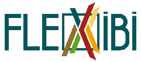

# Bioresource Inventory Tool (BRIT)

BRIT is a browser-based tool, designed to improve the understanding and management of biogenic residue waste streams. 
The tool aims to offer its users a comprehensive view of the entire waste generation, collection, and processing 
landscape using mapping and visualization approaches, as well as interactive scenario development.

## Access

A public instance of this tool is hosted by Hamburg University of Technology and can be accessed at
https://brit.bioresource-tools.net.

This instance contains the data and case studies from the projects FLEXIBI and SOILCOM as well as other data produced 
by the BIEM research group.

BRIT is under constant development. Please feel free to leave any kind of feedback at
[info@bioresource-tools.net](mailto:info@bioresource-tools.net)

## The SOILCOM project

SOILCOM is a project of the Interreg North Sea Region Programme, co-funded by the European Union.
The project focused on sustainable soil management through the utilization of waste streams as a resource for 
custom-made composts. 
Within work package 4 *Waste Streams* of SOILCOM, BRIT was significantly improved, especially the user interface and 
usability across all modules. 
The tool was extended with the *Household Waste Collection* module, which then was applied for the collaborative data 
collection on biowaste collection systems in the North Sea Region.

The state of BRIT at the end of SOILCOM is fixed as release
[Version 0.2 "SOILCOM"](https://github.com/lueho/BRIT/releases/tag/0.2).

SOILCOM website: https://www.northsearegion.eu/soilcom

## The FLEXIBI project

FLEXIBI was an ERA-NET project, which has received funding from the German Ministry of Education and Research (BMBF).
The project studied the potential of residues from agri– and horticulture, gardening and landscaping, as well as from 
post-consumer wood from peri-urban and urban areas as feedstocks for Small-Scale Flexi-Feed Biorefineries (SFB). 
During the project, the proof of concept for BRIT as part of a decision-support-tool was accomplished. 
It was clear that a tool for data collection and inventories could be built as easy to use online-tool, relying on only
open-source libraries. 
The name Bioresource Information Tool was coined and the first prototype was built.

The state of BRIT at the end of FLEXIBI is fixed as release 
[Version 0.1 "FLEXIBI"](https://github.com/lueho/BRIT/releases/tag/0.1).

FLEXIBI website: http://www.flexibi-biorefineries.eu

## The BIEM research group
BIEM is a research group that is dedicated to bioresource management.
It is based at the Institute of Wastewater Management and Water Protection of the Hamburg University of Technology. 
To find out more about the group and its most recent research, visit https://www.tuhh.de/alt/aww/research/biem.

The BIEM group operates a platform to disseminate the tools, lectures and info
material from the various projects it is involved in: https://www.bioresource-tools.net

