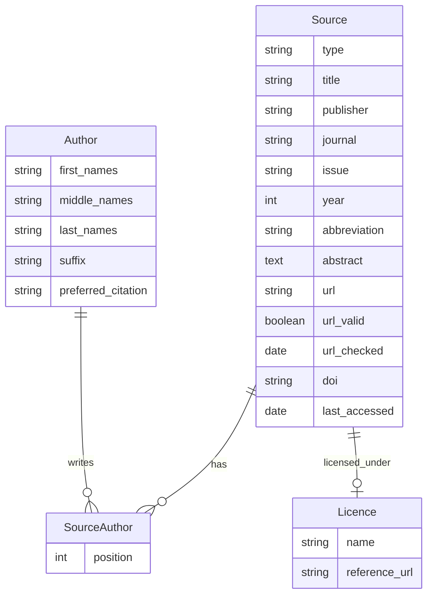

# Bibliography Module

## Overview
The Bibliography module is a component of the Bioresource Inventory Tool (BRIT) that manages bibliographic references. It provides functionality for storing, organizing, and retrieving information about various types of sources such as articles, books, datasets, and websites.

## Features
- Management of bibliographic sources with detailed metadata
- Author management with proper name formatting
- License tracking for sources
- URL validation for online sources
- BibTeX formatting support
- Autocomplete functionality for authors and sources

## Models

### Author
Represents an author of a bibliographic source with fields for:
- First, middle, and last names
- Suffix
- Preferred citation format

### Licence
Represents a license under which a source is published:
- Name
- Reference URL

### Source
Represents a bibliographic source with fields for:
- Type (article, dataset, book, website, custom)
- Title
- Authors (many-to-many relationship)
- Publisher
- Journal
- Issue
- Year
- Abbreviation
- Abstract
- License
- URL with validation
- DOI
- Last accessed date

### SourceAuthor
A through model for the many-to-many relationship between Source and Author:
- Maintains the position/order of authors for a source

## Views
The module provides a complete set of views for managing bibliographic data:
- Dashboard view
- CRUD operations for Authors, Licences, and Sources
- Autocomplete functionality
- URL validation tools

## Entity Relationship Diagram

## Integration
The Bibliography module integrates with other BRIT modules by providing reference information for data sources used throughout the application.
