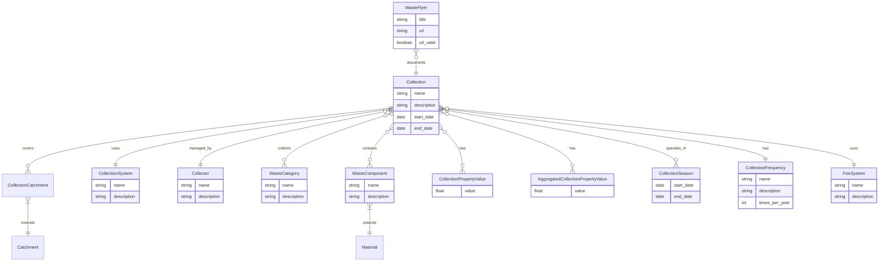

# SOILCOM Case Study Module

## Overview
The SOILCOM module is a case study implementation within the Bioresource Inventory Tool (BRIT) focused on sustainable soil management through the utilization of waste streams as a resource for custom-made composts. It was developed as part of the Interreg North Sea Region Programme's SOILCOM project, co-funded by the European Union.

## Features
- Comprehensive waste collection system management
- Spatial representation of collection catchments
- Temporal modeling of collection frequencies and seasons
- Waste categorization and component tracking
- Fee system management
- Documentation through waste flyers
- Property value tracking for collections
- Data visualization through maps

## Models

### Collection System
- **CollectionCatchment**: Geographic areas where waste is collected, extending the base Catchment model
- **Collector**: Organizations or entities that collect waste
- **CollectionSystem**: Systems and methods used for waste collection
- **Collection**: The main model representing waste collection activities

### Waste Classification
- **WasteCategory**: Categories of waste (e.g., organic, recyclable)
- **WasteComponent**: Specific components of waste, extending the Material model
- **WasteStream**: Flows of waste through the collection system

### Documentation
- **WasteFlyer**: Documentation related to waste collection, extending the Source model

### Temporal Aspects
- **CollectionSeason**: Seasonal periods for waste collection
- **CollectionFrequency**: Frequency of waste collection
- **CollectionCountOptions**: Options for collection counts

### Financial Aspects
- **FeeSystem**: Payment systems for waste collection

### Properties
- **CollectionPropertyValue**: Property values associated with collections
- **AggregatedCollectionPropertyValue**: Aggregated property values for collections

## Views
The module provides a complete set of views for managing waste collection data:
- Dashboard view
- CRUD operations for all models
- Map views for spatial visualization
- File export functionality
- Property value management
- Waste sample management
- Collection predecessor tracking

## Entity Relationship Diagram

## Integration
The SOILCOM module integrates with other BRIT modules:
- Maps module for spatial representation
- Materials module for waste component classification
- Bibliography module for documentation sources
- Distributions module for temporal modeling

## Usage
The SOILCOM module was applied for collaborative data collection on biowaste collection systems in the North Sea Region, providing valuable insights into sustainable waste management practices.
