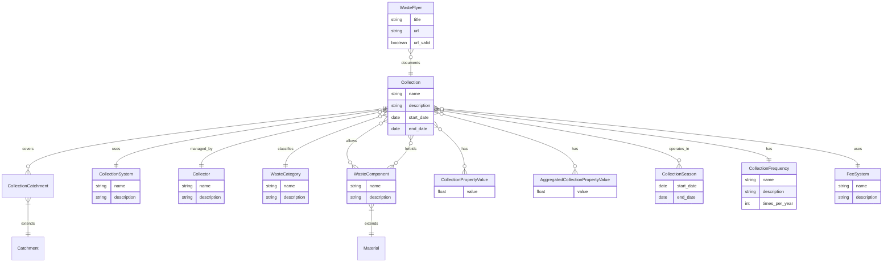

# SOILCOM Case Study Module

## Overview
The SOILCOM module is a case study implementation within the Bioresource Inventory Tool (BRIT) focused on sustainable soil management through the utilization of separately collected organic waste as a resource for custom-made composts. It was developed as part of the Interreg North Sea Region Programme's SOILCOM project, co-funded by the European Union.

## Features
- Comprehensive waste collection system management
- Spatial representation of collection catchments
- Temporal modeling of collection frequencies and seasons
- Waste categorization and component tracking
- Fee system management
- Documentation through waste flyers
- Property value tracking for collections
- Data visualization through maps

## Models

### Collection System
- **CollectionCatchment**: Geographic areas where waste is collected, extending the base Catchment model
- **Collector**: Organizations or entities that collect waste
- **CollectionSystem**: Systems and methods used for waste collection
- **Collection**: The main model representing waste collection activities

### Waste Classification
- **WasteCategory**: Categories of waste (e.g., organic, recyclable)
- **WasteComponent**: Specific components of waste, extending the Material model
- Waste classification rules are configured directly on **Collection** via:
  - `waste_category`
  - `allowed_materials`
  - `forbidden_materials`

### Documentation
- **WasteFlyer**: Documentation related to waste collection, extending the Source model

### Temporal Aspects
- **CollectionSeason**: Seasonal periods for waste collection
- **CollectionFrequency**: Frequency of waste collection
- **CollectionCountOptions**: Options for collection counts

### Financial Aspects
- **FeeSystem**: Payment systems for waste collection

### Properties
- **CollectionPropertyValue**: Property values associated with collections
- **AggregatedCollectionPropertyValue**: Aggregated property values for collections

## Views
The module provides a complete set of views for managing waste collection data:
- Dashboard view
- CRUD operations for all models
- Map views for spatial visualization
- File export functionality
- Property value management
- Waste sample management
- Collection predecessor tracking

## Scoped Collection Filtering

The generic scope rules for filtered lists and maps are defined in
[`docs/02_developer_guide/security_permission_validation.md`](../../docs/02_developer_guide/security_permission_validation.md).
SOILCOM collections are expected to follow those shared rules first.

### Shared behavior reused by SOILCOM collections

- `CollectionPublishedListView`, `CollectionPrivateListView`, and
  `CollectionReviewListView` / `CollectionReviewFilterView` build on the shared
  `PublishedObjectFilterView`, `PrivateObjectFilterView`, and
  `ReviewObjectFilterView` scope mixins.
- `WasteCollectionPublishedMapView`, `WasteCollectionPrivateMapView`, and
  `WasteCollectionReviewMapView` reuse the same shared scope pattern for the
  map representation.
- `CollectionFilterSet` extends `UserCreatedObjectScopedFilterSet`, so the
  `scope` parameter is resolved through `apply_scope_filter(...)` before
  collection-specific filters narrow the queryset further.
- If a scoped filterset exposes a `publication_status` field, the shared base
  filterset hides that control outside the private scope.
- Hierarchical spatial search is treated as a shared rule. In the collection
  implementation, `catchment` expands through related catchments across scopes
  rather than switching to exact matching in review views.

### SOILCOM-specific collection aspects

- `catchment` is implemented on top of the shared hierarchical spatial-search
  rule. In `CollectionFilterSet.catchment_filter(...)`, the selected catchment
  expands to collection-specific related catchments:
  - `custom` catchments use `inside_collections`
  - otherwise the filter prefers `downstream_collections`
  - if none exist, it falls back to `upstream_collections`
- country-level `nuts` catchments fall back to filtering by country when
  hierarchy links are incomplete
- Collection-specific filter dimensions include waste category, allowed and
  forbidden materials, connection type, connection rate, seasonal and optional
  frequency, bin capacities, collections per year, and specific waste
  collected.
- Regression tests for the collection-specific catchment behavior live in
  `case_studies/soilcom/tests/test_filters.py`.

## Entity Relationship Diagram

```mermaid
erDiagram
    Collection ||--o{ CollectionCatchment : "covers"
    Collection }o--|| CollectionSystem : "uses"
    Collection }o--|| Collector : "managed_by"
    Collection }o--|| WasteCategory : "classifies"
    Collection }o--o{ WasteComponent : "allows"
    Collection }o--o{ WasteComponent : "forbids"
    Collection }o--o{ CollectionPropertyValue : "has"
    Collection }o--o{ AggregatedCollectionPropertyValue : "has"
    Collection }o--o{ CollectionSeason : "operates_in"
    Collection }o--|| CollectionFrequency : "has"
    Collection }o--|| FeeSystem : "uses"

    WasteFlyer }o--|| Collection : "documents"

    CollectionCatchment }|--|| Catchment : "extends"

    WasteComponent }|--|| Material : "extends"

    Collection {
        string name
        string description
        date start_date
        date end_date
    }

    CollectionSystem {
        string name
        string description
    }

    Collector {
        string name
        string description
    }

    WasteCategory {
        string name
        string description
    }

    WasteComponent {
        string name
        string description
    }

    CollectionFrequency {
        string name
        string description
        int times_per_year
    }

    FeeSystem {
        string name
        string description
    }

    CollectionSeason {
        date start_date
        date end_date
    }

    CollectionPropertyValue {
        float value
    }

    AggregatedCollectionPropertyValue {
        float value
    }

    WasteFlyer {
        string title
        string url
        boolean url_valid
    }
```

## Integration
The SOILCOM module integrates with other BRIT modules:
- Maps module for spatial representation
- Materials module for waste component classification
- Bibliography module for documentation sources
- Distributions module for temporal modeling

## Usage
The SOILCOM module was applied for collaborative data collection on biowaste collection systems in the North Sea Region, providing valuable insights into sustainable waste management practices.
