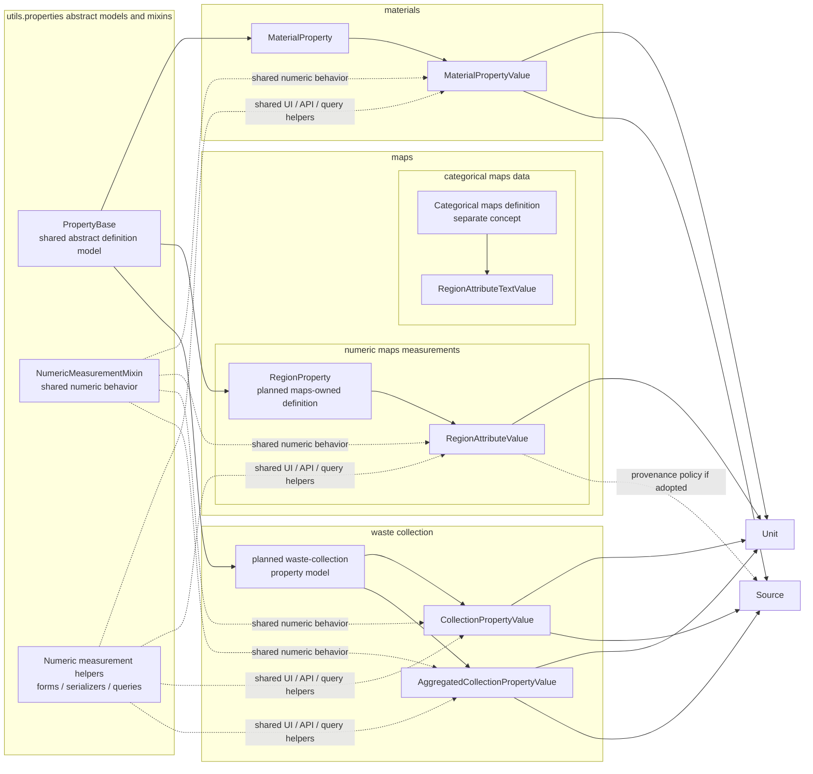

# Property Unification Current State and Remaining Work

- **Status**: In progress
- **Date**: 2026-03-27
- **Last updated**: 2026-04-09
- **Context**: Phase 1 established shared numeric measurement behavior in `utils.properties`. Phase 2 separated categorical maps data from numeric maps data. Phase 3 aligned numeric maps definitions with `PropertyBase`. On 2026-03-27 the architectural decision was clarified further: the final pattern should be one concrete `PropertyBase`-backed property table per domain, with `utils.properties` providing shared review workflow, forms, serializers, and measurement helpers. This means the current direct use of the generic `Property` table outside its own domain is transitional rather than the desired end-state.

---

## 1. Current Position After Phase 3

### 1.1 Implemented in Phases 1-3

Phase 1-3 established shared behavior and shared definition contracts rather than shared concrete database tables.

- **Shared model behavior**
  - `utils.properties.models.NumericMeasurementMixin`
  - adopted by `PropertyValue`, `MaterialPropertyValue`, and `RegionAttributeValue`
- **Shared form behavior**
  - `utils.properties.forms.NumericMeasurementFieldsFormMixin`
  - adopted by numeric value forms in `materials`, `maps`, and waste collection
- **Shared serializer behavior**
  - `utils.properties.serializers.NumericMeasurementSerializerMixin`
  - adopted by the generic property serializer and material property serializers
- **Maps semantic split**
  - `RegionAttributeTextValue` now points to `CategoricalAttribute`
  - `Attribute` is now numeric-only in practice
- **Definition-layer convergence**
  - `Attribute(PropertyBase)` now shares the same abstract definition contract as `MaterialProperty(PropertyBase)` and `Property(PropertyBase)`
- **Architecture decision clarified on 2026-03-27**
  - the final target is now one concrete `PropertyBase`-backed property table per domain
  - direct reuse of the generic `Property` table by other domains should be treated as transitional rather than canonical
- **Phase 4 foundation already present**
  - `RegionAttributeValue.unit` exists as a nullable FK to `Unit`
  - migration `maps/migrations/0008_regionattributevalue_unit.py` already performs an initial backfill from `Attribute.unit`
  - maps rendering and serializers already prefer value-level units through `measurement_unit_label`

### 1.2 What remains deliberately unfinished

Phase 1-3 did not attempt to unify storage shapes that still differ materially.

- **Maps** still stores numeric values as `attribute` + `value`
- **Materials** still stores numeric values as `property` + `average`
- **Waste collection** still uses the generic `Property` / `PropertyValue` pattern with year-specific specializations instead of its own concrete property table
- **Maps** still retains `Attribute.unit` as a transitional compatibility field
- **Maps** still keeps text values in `RegionAttributeTextValue`
- **Materials** still carries basis and analytical-method metadata that do not apply to the other domains

This is intentional. The next phases should continue to reduce duplication, but only where the domain model actually benefits.

### 1.3 What we learned in Phases 2 and 3

- **The semantic split in maps was viable without URL churn**
  - the categorical definition path could be introduced while preserving the main maps behavior
- **Definition-level convergence was lower-risk than value-level convergence**
  - `Attribute` could move onto `PropertyBase` cleanly because the concrete maps model kept ownership of its existing field shape
- **The next unit migration reaches beyond the maps app**
  - some external consumers, such as waste-collection serializers, currently read unit metadata from `rav.attribute.unit`
- **`Attribute.unit` should remain a transitional compatibility field during Phase 4**
  - removing or de-emphasizing it should happen only after value-level units and downstream consumers are migrated

---

## 2. Guiding Decision

The target architecture is:

- **shared abstract models and mixins** in `utils.properties`
- **one concrete `PropertyBase`-backed property model per domain**
- **domain-specific concrete value models** in each app that point to their domain property table
- **a separate categorical maps path** outside the shared numeric measurement architecture

The target architecture is not:

- one universal `Property` table for all definition records
- direct reuse of the generic `Property` table as the permanent concrete property model for every domain
- one universal `PropertyValue` table for all numeric and text values
- one shared maps definition concept for both quantitative measurements and categorical labels

### 2.1 Naming conventions

Use the naming patterns that already exist in BRIT.

- **Concrete domain models keep domain nouns**
  - examples: `MaterialProperty`, a future `RegionProperty`, and a future waste-collection property model
- **Behavior-only reuse stays in `...Mixin` classes**
  - examples: `NumericMeasurementMixin`, `NumericMeasurementFieldsFormMixin`, `NumericMeasurementSerializerMixin`
- **`...Base` is reserved for shared abstract model contracts**
  - examples: `PropertyBase`, `BaseMaterial`
- **Concrete Django and DRF classes keep framework suffixes**
  - examples: `RegionAttributeValueModelForm`, `MaterialPropertyValueModelSerializer`
- **Avoid vague architecture labels**
  - prefer real helper names or concise labels like "measurement helpers" over generic terms like "shared service layer"

### 2.2 Why not one concrete table

A single concrete property/value schema would immediately run into domain-specific mismatches, and keeping the generic `Property` table as the final resting place for every domain would hide those differences instead of modeling them explicitly.

- **Materials** needs `basis_component` and `analytical_method`
- **Waste collection** needs `year`, `is_derived`, and aggregated variants
- **Maps** currently mixes quantitative indicators with categorical labels and uses `date` instead of `year`; the categorical side should be separated before deeper numeric convergence

Trying to erase those differences too early would make the code less explicit and increase migration risk.

### 2.3 Final architecture diagram

Key characteristics of the intended end-state:

- **Categorical maps data is separate from numeric measurement architecture**
  - text or label-style regional data should not share the same definition concept as quantitative map measurements
- **Shared abstract models and mixins, domain-owned concrete property tables**
  - `utils.properties` provides shared contracts and behavior, while each domain keeps its own concrete property table
- **The generic `Property` table is transitional, not universal**
  - direct use of `Property` should be treated as an interim implementation until all domains follow the same concrete-table pattern
- **Numeric maps data should converge by adopting the same table pattern, not by moving into the generic `Property` table**
  - maps should end up with a concrete `RegionProperty(PropertyBase)` model while reusing the same shared helpers as other domains
- **Per-value unit ownership for numeric values**
  - numeric value records point to `Unit`, rather than relying only on definition-level unit metadata
- **Text values stay separate**
  - `RegionAttributeTextValue` remains distinct from numeric value storage
- **No universal concrete property/value table**
  - unification happens through abstract contracts and named helpers, not through forced table consolidation

---

## 3. Non-Goals

The remaining plan should explicitly avoid the following.

- **Do not force categorical map data into the numeric measurement architecture**
  - text or label-style regional data should not be modeled as if it were just another numeric property/value variant
- **Do not merge numeric and text values into one table**
  - `RegionAttributeTextValue` should remain separate unless there is a compelling domain reason to change it
- **Do not remove materials-specific semantics**
  - `basis_component` and `analytical_method` are domain-relevant and should stay explicit
- **Do not force waste-collection aggregation into generic storage**
  - `AggregatedCollectionPropertyValue` exists for a real reporting use case
- **Do not require a single concrete definition table**
  - app-owned concrete definitions are acceptable if they share stable abstract contracts

---

## 4. Suggested Sequencing for Remaining Work

| Phase | Scope | Risk | Depends on |
|---|---|---|---|
| **4. Maps concrete property-table pivot** | Introduce `RegionProperty`, migrate `RegionAttributeValue`, and keep categorical maps data separate | Medium | 3 recommended |
| **5. Maps unit migration** | Complete `RegionAttributeValue.unit` backfill and reduce fallback dependence on legacy definition-level units | Medium | 4 |
| **6. Maps provenance decision** | Decide whether to add `sources` to map values | Low-Medium | 4 |
| **7. Shared services** | Exports, queries, formatting, conversion helpers | Low | 3-6 as needed |

---

## 5. Execution tracking

Active implementation follow-up for the remaining phases of this plan is now tracked in GitHub issue #88.

This document remains the architectural record for the current state, remaining work, sequencing, and decision rules rather than a live execution tracker.

---

## 6. Decision Rule for Future Phases

For each remaining phase, only proceed if the result satisfies all three criteria.

- **Simpler**
  - fewer parallel implementations or duplicated logic
- **More explicit**
  - domain-specific semantics are still obvious in the concrete model
- **Lower maintenance cost**
  - shared abstractions remove real duplication instead of creating indirection for its own sake

If a proposed unification step fails one of those criteria, keep the code shared at the behavior/service layer instead of forcing deeper schema convergence.
