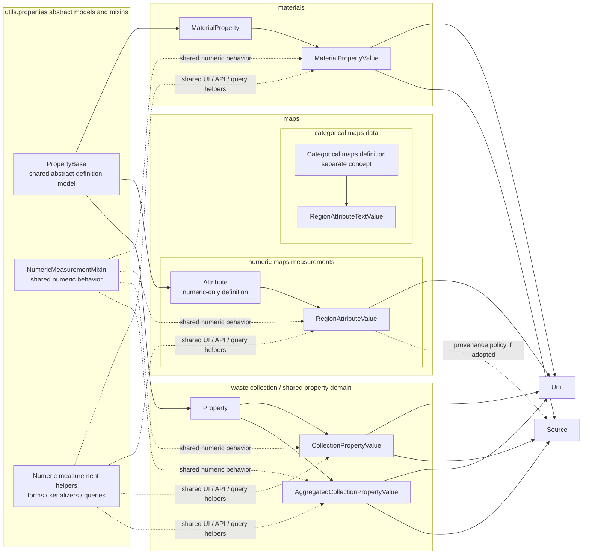

# Property Unification Plan After Phase 3

- **Status**: In progress
- **Date**: 2026-03-26
- **Context**: Phase 1 has been implemented as a low-risk convergence step. Shared numeric measurement behavior now lives in `utils.properties`, and the `materials`, `maps`, and waste-collection domains consume that shared behavior where their existing schemas permit it. Since then, Phase 2 has separated categorical maps data from numeric maps data, and Phase 3 has aligned numeric maps definitions with `PropertyBase`. Phase 4 has now started: `RegionAttributeValue.unit` exists as a nullable FK with an initial backfill migration, but maps and cross-app consumers still rely on transitional fallback behavior from `Attribute.unit`. The remaining work is to finish that migration boundary cleanly without forcing all domains into one concrete table design.

---

## 1. Current Position After Phase 3

### 1.1 Implemented in Phases 1-3

Phase 1-3 established shared behavior and shared definition contracts rather than shared concrete database tables.

- **Shared model behavior**
  - `utils.properties.models.NumericMeasurementMixin`
  - adopted by `PropertyValue`, `MaterialPropertyValue`, and `RegionAttributeValue`
- **Shared form behavior**
  - `utils.properties.forms.NumericMeasurementFieldsFormMixin`
  - adopted by numeric value forms in `materials`, `maps`, and waste collection
- **Shared serializer behavior**
  - `utils.properties.serializers.NumericMeasurementSerializerMixin`
  - adopted by the generic property serializer and material property serializers
- **Maps semantic split**
  - `RegionAttributeTextValue` now points to `CategoricalAttribute`
  - `Attribute` is now numeric-only in practice
- **Definition-layer convergence**
  - `Attribute(PropertyBase)` now shares the same abstract definition contract as `MaterialProperty(PropertyBase)` and `Property(PropertyBase)`
- **Phase 4 foundation already present**
  - `RegionAttributeValue.unit` exists as a nullable FK to `Unit`
  - migration `maps/migrations/0008_regionattributevalue_unit.py` already performs an initial backfill from `Attribute.unit`
  - maps rendering and serializers already prefer value-level units through `measurement_unit_label`

### 1.2 What remains deliberately unfinished

Phase 1-3 did not attempt to unify storage shapes that still differ materially.

- **Maps** still stores numeric values as `attribute` + `value`
- **Materials** still stores numeric values as `property` + `average`
- **Waste collection** still uses `PropertyValue`-style storage with year-specific specializations
- **Maps** still retains `Attribute.unit` as a transitional compatibility field
- **Maps** still keeps text values in `RegionAttributeTextValue`
- **Materials** still carries basis and analytical-method metadata that do not apply to the other domains

This is intentional. The next phases should continue to reduce duplication, but only where the domain model actually benefits.

### 1.3 What we learned in Phases 2 and 3

- **The semantic split in maps was viable without URL churn**
  - the categorical definition path could be introduced while preserving the main maps behavior
- **Definition-level convergence was lower-risk than value-level convergence**
  - `Attribute` could move onto `PropertyBase` cleanly because the concrete maps model kept ownership of its existing field shape
- **The next unit migration reaches beyond the maps app**
  - some external consumers, such as waste-collection serializers, currently read unit metadata from `rav.attribute.unit`
- **`Attribute.unit` should remain a transitional compatibility field during Phase 4**
  - removing or de-emphasizing it should happen only after value-level units and downstream consumers are migrated

---

## 2. Guiding Decision

The target architecture is:

- **shared abstract models and mixins** in `utils.properties`
- **domain-specific concrete models** in each app
- **a separate categorical maps path** outside the shared numeric measurement architecture

The target architecture is not:

- one universal `Property` table for all definition records
- one universal `PropertyValue` table for all numeric and text values
- one shared maps definition concept for both quantitative measurements and categorical labels

### 2.1 Naming conventions

Use the naming patterns that already exist in BRIT.

- **Concrete domain models keep domain nouns**
  - examples: `Property`, `MaterialProperty`, `Attribute`, `MaterialPropertyValue`, `RegionAttributeValue`
- **Behavior-only reuse stays in `...Mixin` classes**
  - examples: `NumericMeasurementMixin`, `NumericMeasurementFieldsFormMixin`, `NumericMeasurementSerializerMixin`
- **`...Base` is reserved for shared abstract model contracts**
  - examples: `PropertyBase`, `BaseMaterial`
- **Concrete Django and DRF classes keep framework suffixes**
  - examples: `RegionAttributeValueModelForm`, `MaterialPropertyValueModelSerializer`
- **Avoid vague architecture labels**
  - prefer real helper names or concise labels like "measurement helpers" over generic terms like "shared service layer"

### 2.2 Why not one concrete table

A single concrete property/value schema would immediately run into domain-specific mismatches.

- **Materials** needs `basis_component` and `analytical_method`
- **Waste collection** needs `year`, `is_derived`, and aggregated variants
- **Maps** currently mixes quantitative indicators with categorical labels and uses `date` instead of `year`; the categorical side should be separated before deeper numeric convergence

Trying to erase those differences too early would make the code less explicit and increase migration risk.

### 2.3 Final architecture diagram



Key characteristics of the intended end-state:

- **Categorical maps data is separate from numeric measurement architecture**
  - text or label-style regional data should not share the same definition concept as quantitative map measurements
- **Shared abstract models and mixins, app-owned concrete models**
  - `utils.properties` provides shared contracts and behavior, while each domain keeps its own concrete tables
- **Numeric maps data can then converge honestly with other numeric domains**
  - once maps definitions are quantitative-only, they can share the same abstract contracts as materials and waste collection without dragging categorical semantics along
- **Per-value unit ownership for numeric values**
  - numeric value records point to `Unit`, rather than relying only on definition-level unit metadata
- **Text values stay separate**
  - `RegionAttributeTextValue` remains distinct from numeric value storage
- **No universal concrete property/value table**
  - unification happens through abstract contracts and named helpers, not through forced table consolidation

---

## 3. Remaining Plan

## 3.1 Phase 2 — Separate categorical maps data from quantitative definitions

- **Status**: Completed

### Goal

Make maps categorical data a separate concept from numeric measurement data.

### Proposed change

Introduce a distinct categorical definition/value path in maps so numeric map measurements no longer share the same definition concept with text labels.

Desired end state:

- `Attribute` becomes explicitly numeric-only, or is replaced by a clearly quantitative maps definition model
- `RegionAttributeValue` remains the numeric value record for regional measurements
- `RegionAttributeTextValue` points to a separate categorical definition model rather than a numeric measurement definition

### Scope

- Identify all maps views, forms, serializers, and filters that currently treat `Attribute` as both numeric and categorical
- Introduce or migrate to a dedicated categorical definition model for text values
- Preserve current maps behavior and URLs where possible while making the semantic split explicit

### Why this phase matters

This removes the main conceptual conflation in maps.

After this split, the numeric side of maps can be treated equivalently to the numeric measurement models in other apps without dragging categorical semantics into the shared abstraction layer.

### Risks

- Medium
- Maps CRUD paths may assume one shared definition queryset or foreign key
- Existing filters or summaries may combine numeric and text attributes implicitly

### Exit criteria

- Categorical maps data no longer depends on the same definition concept as numeric map measurements
- Numeric maps definitions are clearly quantitative-only
- maps tests continue to pass

---

## 3.2 Phase 3 — Align numeric definition model inheritance

- **Status**: Completed

### Goal

Make `PropertyBase` the clear shared contract for domain-owned quantitative definitions.

### Proposed change

After the categorical split, keep `utils.properties.models.PropertyBase` as the canonical abstract base for domain-specific quantitative definitions and move the numeric maps definition model onto that contract.

Desired end state:

- `MaterialProperty(PropertyBase)`
- the numeric maps definition model, currently `Attribute`, inherits `PropertyBase`
- `Property(PropertyBase)` remains the generic concrete definition used directly by waste collection

### Scope

- Update the numeric maps definition model to inherit from `PropertyBase`
- Preserve current behavior and URLs in the maps app
- Keep the maps-owned concrete model rather than replacing it with `Property`

### Why this phase matters

Once categorical semantics are no longer mixed in, definition-layer convergence becomes semantically clean instead of overloaded.

It gives all three quantitative domains the same conceptual contract for:

- `name`
- `description`
- default display unit metadata
- ownership and review behavior

### Risks

- Low to medium
- Some maps forms/tests may assume the exact old inheritance chain
- If unit semantics are changed at the same time, the migration becomes riskier; keep this phase focused on model contract alignment

### Exit criteria

- the numeric maps definition model inherits `PropertyBase`
- maps tests continue to pass
- no schema-level unit migration is bundled into this phase

---

## 3.3 Phase 4 — Inventory and introduce value-level unit handling for maps

- **Status**: In progress

### Goal

Bring `RegionAttributeValue` closer to the common numeric value contract by storing unit at the value level, but only after inventorying current unit strings and all consumers that still depend on `Attribute.unit`.

### Proposed change

Run this phase in two explicit sub-steps.

**Phase 4a — inventory and normalization preparation**

1. Inventory all code paths that read `rav.attribute.unit` or otherwise assume unit metadata lives on `Attribute`
2. Inspect current `maps_attribute.unit` strings and classify them into directly resolvable, deterministically normalizable, and unresolved values
3. Identify downstream consumers outside the `maps` app that must be migrated together with maps itself

**Phase 4b — value-level unit migration**

1. Add nullable `unit` FK to `RegionAttributeValue`
2. Resolve existing `Attribute.unit` strings to `Unit` objects where possible
3. Backfill `RegionAttributeValue.unit`
4. Update maps forms, serializers, filters, summary views, and cross-app consumers to prefer `value.unit`
5. Retain fallback to `attribute.unit` temporarily where data is incomplete or still in transition

### Phase 4a findings completed on 2026-03-26

**Schema and code state**

- `RegionAttributeValue.unit` has already been added in `maps/migrations/0008_regionattributevalue_unit.py`
- `NumericMeasurementMixin.measurement_unit_label` already prefers `value.unit` and only falls back to the definition-level unit when the FK is empty
- maps detail rendering and maps summary serializers already consume `measurement_unit_label`, so those paths are structurally ready for value-level units

**Current transitional consumers of `Attribute.unit` or equivalent fallback behavior**

- `maps/forms.py`
  - `RegionAttributeValueModelForm.clean()` still auto-populates a missing value-level unit from `attribute.unit`
- `utils/properties/models.py`
  - `NumericMeasurementMixin.measurement_unit_label` still falls back to the definition-level `unit` field when no value-level unit is set
- `maps/migrations/0008_regionattributevalue_unit.py`
  - the backfill still derives units from `attribute.unit`
- `sources/waste_collection/serializers.py`
  - map exports consume `rav.measurement_unit_label`, so they still depend on the fallback path until all `RegionAttributeValue.unit` rows are populated

**Current dev data inventory**

- observed `maps_attribute.unit` values: `<blank>`, `1/km²`, `km²`
- observed value counts are small in the current dev database
- none of the non-blank current dev `maps_attribute.unit` values matched an existing `Unit` by `name` or `symbol`

**Implications for Phase 4b**

- Phase 4b should not assume the existing `Unit` table is already aligned with maps unit strings
- deterministic unit resolution should match both `Unit.name` and `Unit.symbol`
- where no matching `Unit` exists, the migration path must explicitly decide between creating new `Unit` rows, seeding canonical units first, or leaving specific values unresolved for manual cleanup
- the most important remaining migration boundary is not the presence of the FK itself, but completing backfill and reducing dependence on fallback rendering

### Why this phase matters

This is the single biggest structural difference between maps and the other numeric-property domains.

Once maps has value-level units, cross-domain numeric handling becomes much more coherent.

### Risks

- Medium
- Existing maps values may rely on free-text unit strings that do not resolve cleanly to `Unit`
- Some consumers outside the maps app currently read `rav.attribute.unit`; those paths must be updated carefully
- Some summary and export paths still identify map measurements by attribute name strings, so unit migration may expose additional coupling that should be cleaned up at the same time

### Exit criteria

- the inventory of unit strings and code consumers is complete
- `RegionAttributeValue` has a `unit` FK
- existing data is backfilled where units can be resolved safely
- serializers, views, and cross-app exports render `value.unit` consistently
- `Attribute.unit` is no longer the only source of unit information and remains only as a transitional compatibility field

---

## 3.4 Phase 5 — Evaluate a shared abstract numeric value base

### Goal

After phase 4, evaluate whether the field-level convergence is now strong enough to introduce a shared abstract model for numeric value fields in `utils.properties`.

### Proposed change

If the schemas are aligned enough, introduce a shared abstract base for numeric value fields that centralizes the truly shared fields.

Candidate shape:

```python
class NumericMeasurementValueBase(NamedUserCreatedObject):
    unit = models.ForeignKey(Unit, on_delete=models.PROTECT)
    average = models.DecimalField(...)
    standard_deviation = models.DecimalField(..., null=True, blank=True)
    sources = models.ManyToManyField(Source, blank=True)

    class Meta:
        abstract = True
```

Each domain would still define its own domain relation fields.

Examples:

- `MaterialPropertyValue(NumericMeasurementValueBase)` keeps `property`, `basis_component`, `analytical_method`
- `CollectionPropertyValue(PropertyValue)` may remain on the existing path if that remains clearer
- `RegionAttributeValue` can only join this base if its field types and semantics are aligned enough

### Important note

This phase is optional.

If the result would require awkward renames or forced field shapes, keep the shared layer in mixins and helpers rather than forcing a schema abstraction.

### Risks

- Medium to high if attempted too early
- Abstract base migrations are safe only when the concrete fields already match in name, type, and semantics

### Exit criteria

- A shared abstract base is introduced only if it simplifies the concrete models
- No domain-specific metadata is lost or obscured

---

## 3.5 Phase 6 — Clarify provenance expectations for maps values

### Goal

Decide whether numeric map values should support the same provenance pattern as material and collection values.

### Question to answer

Should `RegionAttributeValue` gain `sources`, or should maps remain intentionally lighter-weight?

### Recommendation

Only add `sources` if map attributes are expected to behave like evidence-backed observations rather than display-oriented statistics.

If added:

- use the same `Source` relation pattern already used in `PropertyValue` and `MaterialPropertyValue`
- update CRUD forms and serializers at the same time

If not added:

- document maps as intentionally lighter-weight and keep provenance outside the value record

### Risks

- Low to medium
- More consistency if added, but also more UI and validation surface in maps

### Exit criteria

- provenance handling for maps is an explicit decision, not an accident of history

---

## 3.6 Phase 7 — Cross-domain services and queries

### Goal

Once the data contracts are aligned enough, introduce shared services for cross-domain measurement handling.

### Candidate additions

- shared formatting helpers for numeric measurement displays
- shared filtering helpers for unit-aware numeric values
- shared export helpers for property/value tables
- optional conversion helpers if unit normalization is expanded further

### Examples

- common "measurement label + unit" presentation logic
- consistent export column generation
- shared API helpers for numeric measurement payloads

### Risks

- Low
- This phase should come after the data contracts are stable enough to avoid repeated rewrites

### Exit criteria

- obvious cross-domain duplication in formatting/export/query logic is removed
- the service layer remains smaller than the domain code that uses it

---

## 4. Non-Goals

The remaining plan should explicitly avoid the following.

- **Do not force categorical map data into the numeric measurement architecture**
  - text or label-style regional data should not be modeled as if it were just another numeric property/value variant
- **Do not merge numeric and text values into one table**
  - `RegionAttributeTextValue` should remain separate unless there is a compelling domain reason to change it
- **Do not remove materials-specific semantics**
  - `basis_component` and `analytical_method` are domain-relevant and should stay explicit
- **Do not force waste-collection aggregation into generic storage**
  - `AggregatedCollectionPropertyValue` exists for a real reporting use case
- **Do not require a single concrete definition table**
  - app-owned concrete definitions are acceptable if they share stable abstract contracts

---

## 5. Suggested Sequencing

| Phase | Scope | Risk | Depends on |
|---|---|---|---|
| **1. Shared behavior** | Shared mixins for models/forms/serializers | Done | None |
| **2. Maps semantic split** | Separate categorical maps data from quantitative definitions | Done | 1 |
| **3. Definition convergence** | Numeric maps definition onto `PropertyBase` | Done | 2 |
| **4. Maps unit migration** | Inventory unit strings and consumers, complete `RegionAttributeValue.unit` backfill, and reduce fallback dependence | Medium | 3 recommended |
| **5. Optional abstract DB bases** | Shared concrete field base(s) where justified | Medium-High | 4 |
| **6. Maps provenance decision** | Decide whether to add `sources` to map values | Low-Medium | 4 |
| **7. Shared services** | Exports, queries, formatting, conversion helpers | Low | 3-6 as needed |

---

## 6. Recommended Next Implementation Step

The next implementation step should be **Phase 4b**.

Why:

- the inventory work is now concrete enough to stop planning and finish the migration boundary
- the FK and initial backfill already exist, so the remaining risk is incomplete data alignment and fallback dependence rather than missing schema
- the current dev inventory shows that maps unit strings are not yet aligned with existing `Unit` rows, so Phase 4b must make that decision explicit instead of relying on accidental matches

Concretely, the next Phase 4b step should answer these questions in code and data:

- Should unresolved maps units create canonical `Unit` rows automatically, or should canonical units be seeded first and unresolved values left visible for manual cleanup?
- Which remaining maps values still have `unit_id IS NULL`, and can they be backfilled deterministically from the current `Attribute.unit` labels?
- Which fallback consumers should remain temporarily, and which should switch to strict value-level-unit behavior once backfill coverage is acceptable?

---

## 7. Decision Rule for Future Phases

For each remaining phase, only proceed if the result satisfies all three criteria.

- **Simpler**
  - fewer parallel implementations or duplicated logic
- **More explicit**
  - domain-specific semantics are still obvious in the concrete model
- **Lower maintenance cost**
  - shared abstractions remove real duplication instead of creating indirection for its own sake

If a proposed unification step fails one of those criteria, keep the code shared at the behavior/service layer instead of forcing deeper schema convergence.
