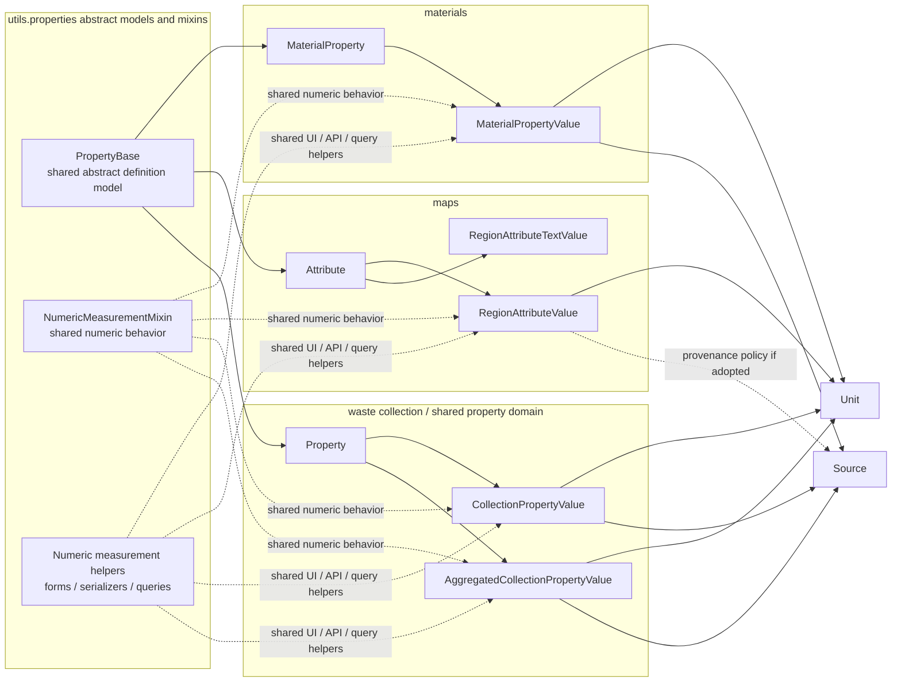

# Property Unification Plan After Phase 1

- **Status**: Proposed
- **Date**: 2026-03-25
- **Context**: Phase 1 has been implemented as a low-risk convergence step. Shared numeric measurement behavior now lives in `utils.properties`, and the `materials`, `maps`, and waste-collection domains consume that shared behavior where their existing schemas permit it. The remaining work is to converge definition and value patterns further without forcing all domains into one concrete table design.

---

## 1. Current Position After Phase 1

### 1.1 Implemented in Phase 1

Phase 1 established shared behavior rather than shared database tables.

- **Shared model behavior**
  - `utils.properties.models.NumericMeasurementMixin`
  - adopted by `PropertyValue`, `MaterialPropertyValue`, and `RegionAttributeValue`
- **Shared form behavior**
  - `utils.properties.forms.NumericMeasurementFieldsFormMixin`
  - adopted by numeric value forms in `materials`, `maps`, and waste collection
- **Shared serializer behavior**
  - `utils.properties.serializers.NumericMeasurementSerializerMixin`
  - adopted by the generic property serializer and material property serializers

### 1.2 What Phase 1 deliberately did not do

Phase 1 did not attempt to unify storage shapes that still differ materially.

- **Maps** still stores numeric values as `attribute` + `value`
- **Materials** still stores numeric values as `property` + `average`
- **Waste collection** still uses `PropertyValue`-style storage with year-specific specializations
- **Maps** still stores unit metadata on `Attribute`, not on `RegionAttributeValue`
- **Maps** still keeps text values in `RegionAttributeTextValue`
- **Materials** still carries basis and analytical-method metadata that do not apply to the other domains

This is intentional. The next phases should continue to reduce duplication, but only where the domain model actually benefits.

---

## 2. Guiding Decision

The target architecture is:

- **shared abstract models and mixins** in `utils.properties`
- **domain-specific concrete models** in each app

The target architecture is not:

- one universal `Property` table for all definition records
- one universal `PropertyValue` table for all numeric and text values

### 2.1 Naming conventions

Use the naming patterns that already exist in BRIT.

- **Concrete domain models keep domain nouns**
  - examples: `Property`, `MaterialProperty`, `Attribute`, `MaterialPropertyValue`, `RegionAttributeValue`
- **Behavior-only reuse stays in `...Mixin` classes**
  - examples: `NumericMeasurementMixin`, `NumericMeasurementFieldsFormMixin`, `NumericMeasurementSerializerMixin`
- **`...Base` is reserved for shared abstract model contracts**
  - examples: `PropertyBase`, `BaseMaterial`
- **Concrete Django and DRF classes keep framework suffixes**
  - examples: `RegionAttributeValueModelForm`, `MaterialPropertyValueModelSerializer`
- **Avoid vague architecture labels**
  - prefer real helper names or concise labels like "measurement helpers" over generic terms like "shared service layer"

### 2.2 Why not one concrete table

A single concrete property/value schema would immediately run into domain-specific mismatches.

- **Materials** needs `basis_component` and `analytical_method`
- **Waste collection** needs `year`, `is_derived`, and aggregated variants
- **Maps** has both numeric and text values and currently uses `date` instead of `year`

Trying to erase those differences too early would make the code less explicit and increase migration risk.

### 2.3 Final architecture diagram



Key characteristics of the intended end-state:

- **Shared abstract models and mixins, app-owned concrete models**
  - `utils.properties` provides shared contracts and behavior, while each domain keeps its own concrete tables
- **Per-value unit ownership for numeric values**
  - numeric value records point to `Unit`, rather than relying only on definition-level unit metadata
- **Text values stay separate**
  - `RegionAttributeTextValue` remains distinct from numeric value storage
- **No universal concrete property/value table**
  - unification happens through abstract contracts and named helpers, not through forced table consolidation

---

## 3. Remaining Plan

## 3.1 Phase 2 — Align definition model inheritance

### Goal

Make `PropertyBase` the clear shared contract for domain-owned quantitative definitions.

### Proposed change

Keep `utils.properties.models.PropertyBase` as the canonical abstract base for domain-specific quantitative definitions and move `maps.Attribute` onto that contract.

Desired end state:

- `MaterialProperty(PropertyBase)`
- `Attribute(PropertyBase)`
- `Property(PropertyBase)` remains the generic concrete definition used directly by waste collection

### Scope

- Update `maps.models.Attribute` to inherit from `PropertyBase`
- Preserve current behavior and URLs in the maps app
- Keep `Attribute` as a maps-owned concrete model rather than replacing it with `Property`

### Why this phase matters

This aligns the definition layer first without forcing cross-app table reuse.

It gives all three domains the same conceptual contract for:

- `name`
- `description`
- default display unit metadata
- ownership and review behavior

### Risks

- Low to medium
- Some maps forms/tests may assume the exact old inheritance chain
- If unit semantics are changed at the same time, the migration becomes riskier; keep this phase focused on model contract alignment

### Exit criteria

- `Attribute` inherits `PropertyBase`
- maps tests continue to pass
- no schema-level unit migration is bundled into this phase

---

## 3.2 Phase 3 — Introduce value-level unit handling for maps

### Goal

Bring `RegionAttributeValue` closer to the common numeric value contract by storing unit at the value level.

### Proposed change

Add a `unit` foreign key to `RegionAttributeValue` and treat `Attribute.unit` as a transitional default or display fallback.

Possible migration sequence:

1. Add nullable `unit` FK to `RegionAttributeValue`
2. Resolve existing `Attribute.unit` strings to `Unit` objects
3. Backfill `RegionAttributeValue.unit`
4. Update maps forms, serializers, filters, and summary views to prefer `value.unit`
5. Retain fallback to `attribute.unit` temporarily where data is incomplete

### Why this phase matters

This is the single biggest structural difference between maps and the other numeric-property domains.

Once maps has value-level units, cross-domain numeric handling becomes much more coherent.

### Risks

- Medium
- Existing maps values may rely on free-text unit strings that do not resolve cleanly to `Unit`
- Summary serializers currently read `rav.attribute.unit`; those paths must be updated carefully

### Exit criteria

- `RegionAttributeValue` has a `unit` FK
- existing data is backfilled
- serializers and views render `value.unit` consistently
- `Attribute.unit` is no longer the only source of unit information

---

## 3.3 Phase 4 — Evaluate a shared abstract numeric value base

### Goal

After phase 3, evaluate whether the field-level convergence is now strong enough to introduce a shared abstract model for numeric value fields in `utils.properties`.

### Proposed change

If the schemas are aligned enough, introduce a shared abstract base for numeric value fields that centralizes the truly shared fields.

Candidate shape:

```python
class NumericMeasurementValueBase(NamedUserCreatedObject):
    unit = models.ForeignKey(Unit, on_delete=models.PROTECT)
    average = models.DecimalField(...)
    standard_deviation = models.DecimalField(..., null=True, blank=True)
    sources = models.ManyToManyField(Source, blank=True)

    class Meta:
        abstract = True
```

Each domain would still define its own domain relation fields.

Examples:

- `MaterialPropertyValue(NumericMeasurementValueBase)` keeps `property`, `basis_component`, `analytical_method`
- `CollectionPropertyValue(PropertyValue)` may remain on the existing path if that remains clearer
- `RegionAttributeValue` can only join this base if its field types and semantics are aligned enough

### Important note

This phase is optional.

If the result would require awkward renames or forced field shapes, keep the shared layer in mixins and helpers rather than forcing a schema abstraction.

### Risks

- Medium to high if attempted too early
- Abstract base migrations are safe only when the concrete fields already match in name, type, and semantics

### Exit criteria

- A shared abstract base is introduced only if it simplifies the concrete models
- No domain-specific metadata is lost or obscured

---

## 3.4 Phase 5 — Clarify provenance expectations for maps values

### Goal

Decide whether numeric map values should support the same provenance pattern as material and collection values.

### Question to answer

Should `RegionAttributeValue` gain `sources`, or should maps remain intentionally lighter-weight?

### Recommendation

Only add `sources` if map attributes are expected to behave like evidence-backed observations rather than display-oriented statistics.

If added:

- use the same `Source` relation pattern already used in `PropertyValue` and `MaterialPropertyValue`
- update CRUD forms and serializers at the same time

If not added:

- document maps as intentionally lighter-weight and keep provenance outside the value record

### Risks

- Low to medium
- More consistency if added, but also more UI and validation surface in maps

### Exit criteria

- provenance handling for maps is an explicit decision, not an accident of history

---

## 3.5 Phase 6 — Cross-domain services and queries

### Goal

Once the data contracts are aligned enough, introduce shared services for cross-domain measurement handling.

### Candidate additions

- shared formatting helpers for numeric measurement displays
- shared filtering helpers for unit-aware numeric values
- shared export helpers for property/value tables
- optional conversion helpers if unit normalization is expanded further

### Examples

- common "measurement label + unit" presentation logic
- consistent export column generation
- shared API helpers for numeric measurement payloads

### Risks

- Low
- This phase should come after the data contracts are stable enough to avoid repeated rewrites

### Exit criteria

- obvious cross-domain duplication in formatting/export/query logic is removed
- the service layer remains smaller than the domain code that uses it

---

## 4. Non-Goals

The remaining plan should explicitly avoid the following.

- **Do not merge numeric and text values into one table**
  - `RegionAttributeTextValue` should remain separate unless there is a compelling domain reason to change it
- **Do not remove materials-specific semantics**
  - `basis_component` and `analytical_method` are domain-relevant and should stay explicit
- **Do not force waste-collection aggregation into generic storage**
  - `AggregatedCollectionPropertyValue` exists for a real reporting use case
- **Do not require a single concrete definition table**
  - app-owned concrete definitions are acceptable if they share stable abstract contracts

---

## 5. Suggested Sequencing

| Phase | Scope | Risk | Depends on |
|---|---|---|---|
| **1. Shared behavior** | Shared mixins for models/forms/serializers | Done | None |
| **2. Definition convergence** | `Attribute` onto `PropertyBase` | Low-Medium | 1 |
| **3. Maps value-level units** | `RegionAttributeValue.unit` + backfill | Medium | 2 recommended |
| **4. Optional abstract DB bases** | Shared concrete field base(s) where justified | Medium-High | 3 |
| **5. Maps provenance decision** | Decide whether to add `sources` to map values | Low-Medium | 3 |
| **6. Shared services** | Exports, queries, formatting, conversion helpers | Low | 2-5 as needed |

---

## 6. Recommended Next Implementation Step

The next implementation step should be **Phase 2**.

Why:

- It is smaller and safer than a maps unit migration
- It aligns the definition layer before changing value storage
- It continues the same phase-1 strategy: strengthen shared contracts first, then converge storage carefully

Concretely, Phase 2 should answer these questions in code and tests:

- Can `Attribute` cleanly inherit from `PropertyBase` without breaking maps semantics?
- Which maps tests encode assumptions about `Attribute` today?
- Should `Attribute.unit` remain a simple inherited field for one more phase while value-level units are still pending?

---

## 7. Decision Rule for Future Phases

For each remaining phase, only proceed if the result satisfies all three criteria.

- **Simpler**
  - fewer parallel implementations or duplicated logic
- **More explicit**
  - domain-specific semantics are still obvious in the concrete model
- **Lower maintenance cost**
  - shared abstractions remove real duplication instead of creating indirection for its own sake

If a proposed unification step fails one of those criteria, keep the code shared at the behavior/service layer instead of forcing deeper schema convergence.
