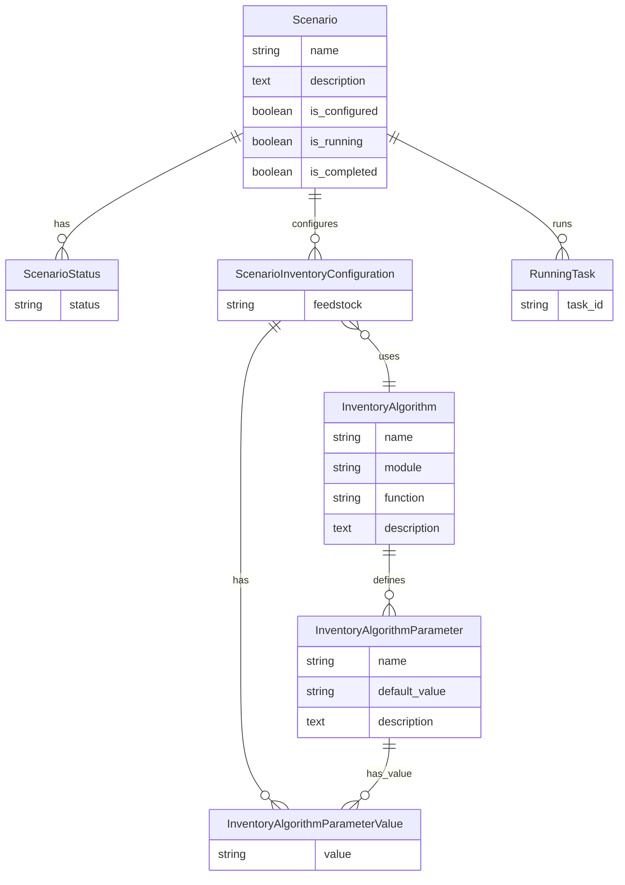

# Inventories Module

## Overview
The Inventories module is a core component of the Bioresource Inventory Tool (BRIT) that enables users to create, configure, and run inventory scenarios for bioresources. It provides functionality for calculating the availability and distribution of various bioresource feedstocks across geographic regions using different inventory algorithms.

## Features
- Creation and management of inventory scenarios
- Configuration of inventory algorithms with customizable parameters
- Integration with geographic datasets for spatial analysis
- Support for multiple feedstock types
- Calculation of bioresource availability and distribution
- Visualization of inventory results on maps
- Export of scenario summaries and results

## Models

### Scenario
The central model representing an inventory scenario:
- Basic information (name, description)
- Status tracking (configured, running, completed, etc.)
- Methods for managing feedstocks, geodatasets, and inventory algorithms
- Configuration management
- Result tracking and visualization

### InventoryAlgorithm
Represents algorithms used to calculate bioresource inventories:
- Name and description
- Module and function references
- Default parameter values
- Methods for discovering available modules and functions

### InventoryAlgorithmParameter
Represents parameters for inventory algorithms:
- Name and description
- Default value
- Associated algorithm

### InventoryAlgorithmParameterValue
Represents specific values for algorithm parameters:
- Value (string, numeric, boolean)
- Associated parameter and configuration

### ScenarioStatus
Tracks the status of scenarios:
- Status options (configured, running, completed, error)
- Associated scenario

### ScenarioInventoryConfiguration
Represents the configuration of an inventory algorithm for a specific scenario:
- Associated scenario, feedstock, and algorithm
- Parameter values
- Methods for saving and retrieving configurations

### RunningTask
Tracks running inventory calculation tasks:
- Task ID
- Associated scenario

## Entity Relationship Diagram

## Views
The module provides a comprehensive set of views for managing inventory scenarios:
- CRUD operations for scenarios
- Views for adding, updating, and removing inventory algorithms
- Views for downloading scenario summaries and results
- Views for loading options for catchments, geodatasets, algorithms, and parameters
- API views for result maps
- Views for scenario evaluation progress and results

## Integration
The Inventories module integrates with other BRIT modules:
- Maps module for spatial representation and visualization
- Materials module for feedstock information
- Layer Manager module for managing result layers

## Usage
This module is used to:
- Create inventory scenarios for different bioresources
- Configure and run inventory calculations
- Visualize the spatial distribution of bioresources
- Export inventory results for further analysis
- Support decision-making for bioresource management and utilization
