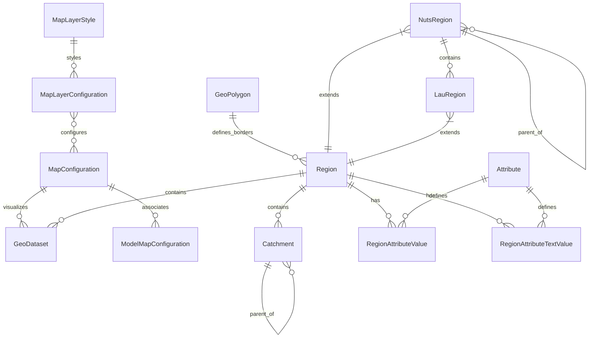

# Maps Module

## Overview
The Maps module is a core component of the Bioresource Inventory Tool (BRIT) that provides geographic data management, visualization, and spatial analysis capabilities. It serves as the foundation for representing spatial information throughout the application, enabling users to visualize bioresources, catchment areas, and other geographic entities.

## Features
- Geographic data representation and management
- Map layer styling and configuration
- Support for administrative boundaries (NUTS and LAU regions)
- Custom region and catchment area definition
- Integration with external geographic datasets
- Spatial attribute management
- Map visualization and interaction

## Models

### Map Configuration
- **MapLayerStyle**: Defines visual styling for map layers (colors, weights, opacity, etc.)
- **MapLayerConfiguration**: Configures how layers are displayed on maps
- **MapConfiguration**: Manages multiple map layers and their settings
- **ModelMapConfiguration**: Associates map configurations with specific models

### Geographic Entities
- **Location**: Represents a point location with optional address
- **GeoPolygon**: Represents a geographic polygon
- **Region**: Represents a geographic region with borders
- **NutsRegion**: Extends Region for NUTS (Nomenclature of Territorial Units for Statistics) regions
- **LauRegion**: Extends Region for LAU (Local Administrative Units) regions
- **Catchment**: Represents a catchment area within a region

### Data Management
- **GeoDataset**: Holds metadata about geographic datasets
- **Attribute**: Defines attributes that can be attached to map features
- **RegionAttributeValue**: Attaches numeric values to regions
- **RegionAttributeTextValue**: Attaches text values to regions

## Entity Relationship Diagram

## Views
The module provides a comprehensive set of views for managing and visualizing geographic data:
- Map views for different types of geographic entities
- CRUD operations for regions, catchments, and other geographic entities
- Layer management views
- Spatial filtering and query views
- GeoJSON API endpoints for map data

## Integration
The Maps module integrates with other BRIT modules:
- Bibliography module for data sources
- Inventories module for spatial representation of inventory data
- Case Studies modules for specialized geographic visualizations
- Layer Manager module for advanced layer management

## Usage
This module is used throughout BRIT to:
- Visualize the spatial distribution of bioresources
- Define and manage catchment areas for data collection
- Represent administrative boundaries
- Attach spatial attributes to geographic entities
- Provide the foundation for spatial analysis and visualization

## Adding a New Map Dataset (User Guide)

### System Summary
The Maps module supports dynamic registration and visualization of new geospatial datasets without code changes. Each dataset is described in the `GeoDataset` model, referencing a database table containing geodata. When a dataset is registered, the system automatically generates a map view, filter form, and query interface using the dataset's metadata. This is controlled by the `ENABLE_GENERIC_DATASET` feature flag for safe rollout.

### Step-by-Step Guide

**Given:** You have a table in the database containing geospatial data (e.g., a PostGIS table with geometry and attribute columns).

#### 1. Prepare Your Data Table
- Ensure your table exists in the database (e.g., via SQL, migration, or import).
- The table must have a primary key column (usually `id`).
- It must contain a geometry column (e.g., `geom`, `geometry`, etc.).
- Add any attribute columns you want to display or filter on.

#### 2. Register the Dataset in the Admin
- Go to the Django admin panel.
- Navigate to **Maps → GeoDatasets**.
- Click **Add GeoDataset**.
- Fill out the following fields:
  - **Name**: Human-readable name for the dataset.
  - **Region**: The region the dataset belongs to.
  - **Table name**: Exact name of your database table (case-sensitive).
  - **Geometry field**: Name of the geometry column in your table.
  - **Display fields**: Comma-separated list of columns to show in popups/tooltips.
  - **Filter fields**: Comma-separated list of columns users can filter by (these will become form fields).
  - (Optional) **Map configuration**: Choose a map config for styling.

#### 3. Enable the Generic Dataset Feature (if not already enabled)
- In your Django settings, set `ENABLE_GENERIC_DATASET = True`.
- Restart the app if needed.

#### 4. Access the Map View
- Go to `/maps/geodatasets/<pk>/map/` where `<pk>` is the ID of your new GeoDataset.
- You will see a map with your data, a filter form for the allowed fields, and attribute popups.

#### 5. (Optional) Customize Map Layer Styling
- Edit the **MapConfiguration** and **MapLayerConfiguration** in the admin to adjust colors, icons, and display settings for your new dataset.

#### 6. Test and Validate
- Use the filter form to query your dataset.
- Check that only the allowed fields are exposed and that sensitive columns are not available for filtering.
- If needed, adjust the GeoDataset metadata.

### Notes
- No code changes or migrations are required for new datasets—everything is driven by metadata.
- For advanced customizations (e.g., custom serializers or API endpoints), consult the developer documentation or contact the development team.
- If you encounter errors, check that your table and columns exist and that the feature flag is enabled.
