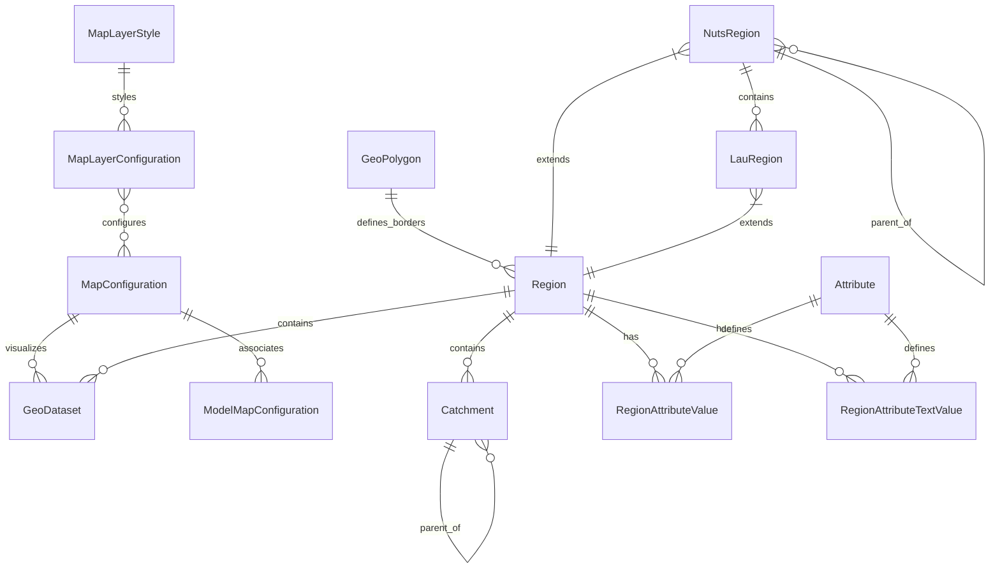

# Maps Module

## Overview
The Maps module is a core component of the Bioresource Inventory Tool (BRIT) that provides geographic data management, visualization, and spatial analysis capabilities. It serves as the foundation for representing spatial information throughout the application, enabling users to visualize bioresources, catchment areas, and other geographic entities.

## Features
- Geographic data representation and management
- Map layer styling and configuration
- Support for administrative boundaries (NUTS and LAU regions)
- Custom region and catchment area definition
- Integration with external geographic datasets
- Spatial attribute management
- Map visualization and interaction

## Models

### Map Configuration
- **MapLayerStyle**: Defines visual styling for map layers (colors, weights, opacity, etc.)
- **MapLayerConfiguration**: Configures how layers are displayed on maps
- **MapConfiguration**: Manages multiple map layers and their settings
- **ModelMapConfiguration**: Associates map configurations with specific models

### Geographic Entities
- **Location**: Represents a point location with optional address
- **GeoPolygon**: Represents a geographic polygon
- **Region**: Represents a geographic region with borders
- **NutsRegion**: Extends Region for NUTS (Nomenclature of Territorial Units for Statistics) regions
- **LauRegion**: Extends Region for LAU (Local Administrative Units) regions
- **Catchment**: Represents a catchment area within a region

### Data Management
- **GeoDataset**: Holds metadata about geographic datasets
- **Attribute**: Defines attributes that can be attached to map features
- **RegionAttributeValue**: Attaches numeric values to regions
- **RegionAttributeTextValue**: Attaches text values to regions

## Entity Relationship Diagram

```mermaid
erDiagram
    MapLayerStyle ||--o{ MapLayerConfiguration : "styles"
    MapLayerConfiguration }o--o{ MapConfiguration : "configures"
    MapConfiguration ||--o{ GeoDataset : "visualizes"
    MapConfiguration ||--o{ ModelMapConfiguration : "associates"

    GeoPolygon ||--o{ Region : "defines_borders"
    Region ||--o{ Catchment : "contains"
    Region ||--o{ GeoDataset : "contains"
    Region ||--o{ RegionAttributeValue : "has"
    Region ||--o{ RegionAttributeTextValue : "has"

    NutsRegion }|--|| Region : "extends"
    LauRegion }|--|| Region : "extends"
    NutsRegion ||--o{ LauRegion : "contains"
    NutsRegion ||--o{ NutsRegion : "parent_of"

    Attribute ||--o{ RegionAttributeValue : "defines"
    Attribute ||--o{ RegionAttributeTextValue : "defines"

    Catchment ||--o{ Catchment : "parent_of"
```

## Views
The module provides a comprehensive set of views for managing and visualizing geographic data:
- Map views for different types of geographic entities
- CRUD operations for regions, catchments, and other geographic entities
- Layer management views
- Spatial filtering and query views
- GeoJSON API endpoints for map data

## Integration
The Maps module integrates with other BRIT modules:
- Bibliography module for data sources
- Inventories module for spatial representation of inventory data
- Case Studies modules for specialized geographic visualizations
- Layer Manager module for advanced layer management

## Usage
This module is used throughout BRIT to:
- Visualize the spatial distribution of bioresources
- Define and manage catchment areas for data collection
- Represent administrative boundaries
- Attach spatial attributes to geographic entities
- Provide the foundation for spatial analysis and visualization

## Current GeoDataset Registry Workflow

`GeoDataset` is the stable user-facing record for geographic datasets. It now supports both legacy model-backed datasets and local PostGIS table/view-backed datasets through normalized runtime metadata.

### Supported local-relation onboarding flow

#### 1. Prepare a trusted local relation
- Use a plain PostGIS table or trusted database view.
- The relation must have a stable primary-key column and a PostGIS geometry column.
- Prepare joins, transformations, or sensitive-field removal outside the generic runtime, usually in a reviewed view.

#### 2. Register the dataset
- Create a `GeoDataset` with normal metadata such as name, description, region, sources, preview image, and optional map configuration.
- Create or edit its `GeoDatasetRuntimeConfiguration` with:
  - `backend_type=local_relation`
  - schema and relation name
  - geometry column
  - primary-key column
  - optional label field

#### 3. Review and promote columns
- Use runtime introspection to inspect available relation columns.
- Add `GeoDatasetColumnPolicy` rows only for columns that should be exposed.
- Visibility, filtering, search, and export settings are explicit policy decisions; discovered columns are not exposed automatically.

#### 4. Explore through dataset-scoped routes
- Metadata/detail: `/maps/geodatasets/<pk>/`
- Map: `/maps/geodatasets/<pk>/map/`
- Table: `/maps/geodatasets/<pk>/table/`
- Feature detail: `/maps/geodatasets/<pk>/features/<feature_pk>/`
- GeoJSON: `/maps/geodatasets/<pk>/features.geojson`

The local-relation runtime supports visible-column table/detail output, exact filtering on explicitly filterable columns, bounded reads, single-feature lookup by configured primary key, and GeoJSON from the configured geometry column.

### Compatibility paths

Some existing datasets still use model-backed compatibility metadata:

- `model_name`
- `runtime_model_name`
- `features_api_basename`
- `ModelMapConfiguration`
- model-specific GeoJSON/detail/summary API routes

These paths remain for existing Django-model datasets and source-domain maps. New ordinary local table/view onboarding should prefer the `local_relation` runtime path unless custom domain behavior is genuinely required.

### Current limits

- Federation, refresh/version metadata, exports, summaries, schema-drift checks, and inventory version pinning are later roadmap phases.
- The generic runtime does not accept arbitrary SQL or user-defined expressions.
- A production pilot should still validate the full operator workflow before broad use.

### Notes for developers

- The authoritative roadmap is `docs/04_design_decisions/2026-04-16_dataset_registry_and_federated_geodata_target_state_plan.md`.
- Keep ingestion, transformation, and harmonization logic outside the generic registry runtime unless the roadmap explicitly moves that boundary.
