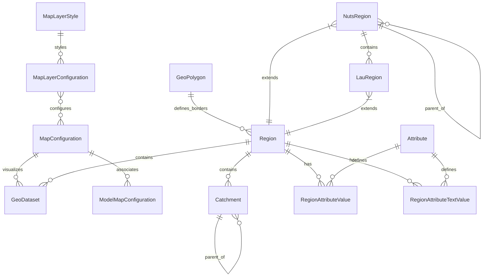

# Maps Module

## Overview
The Maps module is a core component of the Bioresource Inventory Tool (BRIT) that provides geographic data management, visualization, and spatial analysis capabilities. It serves as the foundation for representing spatial information throughout the application, enabling users to visualize bioresources, catchment areas, and other geographic entities.

## Features
- Geographic data representation and management
- Map layer styling and configuration
- Support for administrative boundaries (NUTS and LAU regions)
- Custom region and catchment area definition
- Integration with external geographic datasets
- Spatial attribute management
- Map visualization and interaction

## Models

### Map Configuration
- **MapLayerStyle**: Defines visual styling for map layers (colors, weights, opacity, etc.)
- **MapLayerConfiguration**: Configures how layers are displayed on maps
- **MapConfiguration**: Manages multiple map layers and their settings
- **ModelMapConfiguration**: Associates map configurations with specific models

### Geographic Entities
- **Location**: Represents a point location with optional address
- **GeoPolygon**: Represents a geographic polygon
- **Region**: Represents a geographic region with borders
- **NutsRegion**: Extends Region for NUTS (Nomenclature of Territorial Units for Statistics) regions
- **LauRegion**: Extends Region for LAU (Local Administrative Units) regions
- **Catchment**: Represents a catchment area within a region

### Data Management
- **GeoDataset**: Holds metadata about geographic datasets
- **Attribute**: Defines attributes that can be attached to map features
- **RegionAttributeValue**: Attaches numeric values to regions
- **RegionAttributeTextValue**: Attaches text values to regions

## Entity Relationship Diagram

```mermaid
erDiagram
    MapLayerStyle ||--o{ MapLayerConfiguration : "styles"
    MapLayerConfiguration }o--o{ MapConfiguration : "configures"
    MapConfiguration ||--o{ GeoDataset : "visualizes"
    MapConfiguration ||--o{ ModelMapConfiguration : "associates"

    GeoPolygon ||--o{ Region : "defines_borders"
    Region ||--o{ Catchment : "contains"
    Region ||--o{ GeoDataset : "contains"
    Region ||--o{ RegionAttributeValue : "has"
    Region ||--o{ RegionAttributeTextValue : "has"

    NutsRegion }|--|| Region : "extends"
    LauRegion }|--|| Region : "extends"
    NutsRegion ||--o{ LauRegion : "contains"
    NutsRegion ||--o{ NutsRegion : "parent_of"

    Attribute ||--o{ RegionAttributeValue : "defines"
    Attribute ||--o{ RegionAttributeTextValue : "defines"

    Catchment ||--o{ Catchment : "parent_of"
```

## Views
The module provides a comprehensive set of views for managing and visualizing geographic data:
- Map views for different types of geographic entities
- CRUD operations for regions, catchments, and other geographic entities
- Layer management views
- Spatial filtering and query views
- GeoJSON API endpoints for map data

## Integration
The Maps module integrates with other BRIT modules:
- Bibliography module for data sources
- Inventories module for spatial representation of inventory data
- Case Studies modules for specialized geographic visualizations
- Layer Manager module for advanced layer management

## Usage
This module is used throughout BRIT to:
- Visualize the spatial distribution of bioresources
- Define and manage catchment areas for data collection
- Represent administrative boundaries
- Attach spatial attributes to geographic entities
- Provide the foundation for spatial analysis and visualization

## Current GeoDataset Workflow

### What `GeoDataset` currently does
The current implementation uses `GeoDataset` primarily as a metadata record for datasets that are already backed by existing map views and routes.

Today, a `GeoDataset` can:
- appear in the maps list and gallery views
- store descriptive metadata such as name, description, preview image, region, sources, and map configuration
- link to an existing map experience through `model_name`
- be managed through the existing create, update, delete, autocomplete, and admin workflows

### What `GeoDataset` does not yet do
The current implementation does **not** yet provide a fully metadata-driven registry for arbitrary geospatial tables or views.

In particular, it does **not** currently support:
- registering an arbitrary PostGIS table or view purely through metadata
- storing runtime fields such as table name, geometry column, display fields, or filter fields on `GeoDataset`
- automatically creating a dataset-scoped map route such as `/maps/geodatasets/<pk>/map/`
- replacing hardcoded or plugin-provided map routes with one generic registry-backed runtime path

### Current user-facing workflow

#### 1. Create or edit a `GeoDataset` metadata record
- Use the existing maps forms or Django admin to create and maintain `GeoDataset` records.
- These records are used to organize and describe datasets that BRIT already knows how to display.

#### 2. Browse dataset metadata
- Published datasets are available through the maps list and gallery views.
- Private datasets are available through the corresponding owner-scoped views.

#### 3. Open an existing dataset map/view
- Opening a `GeoDataset` currently depends on its `model_name`.
- `GeoDataset.get_absolute_url()` resolves to an existing named route rather than a dataset-scoped generic map page.
- Those routes currently come either from hardcoded core map views or from source-domain plugin map mounts.

#### 4. Adjust associated styling and references
- `GeoDataset` records can still be associated with sources and map configurations.
- Styling remains driven by the existing `MapConfiguration` and `MapLayerConfiguration` models.

### Notes for developers
- This README documents the **current implemented behavior** only.
- The future metadata-driven dataset registry is tracked in `docs/04_design_decisions/2026-04-16_dataset_registry_and_federated_geodata_target_state_plan.md`.
- If you are planning new dataset-registry work, use the planning document as the authoritative roadmap instead of treating this README as a future-state specification.
