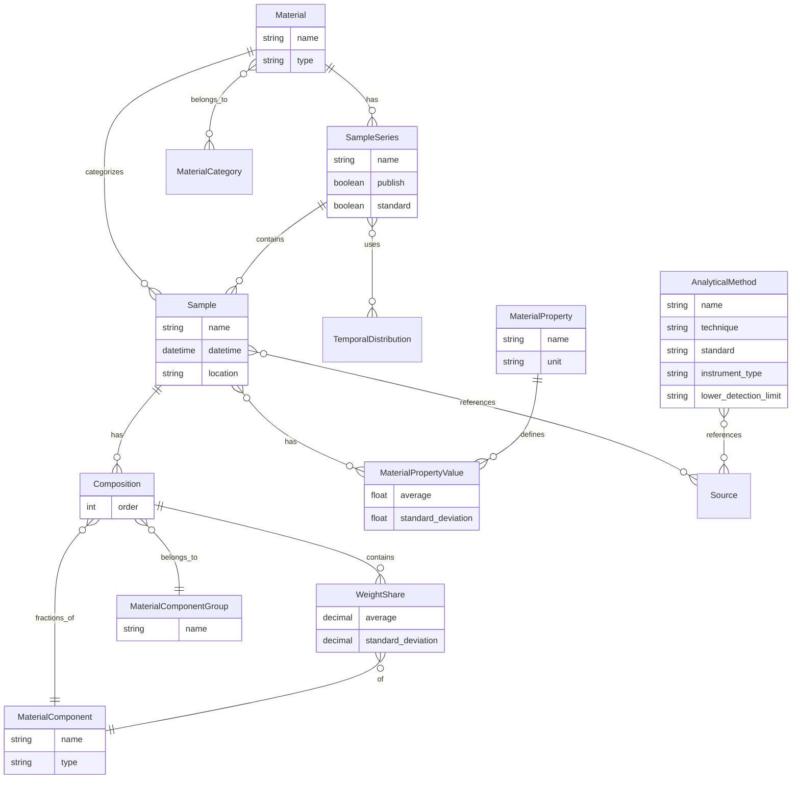

# Materials Module

## Overview
The Materials module is a core component of the Bioresource Inventory Tool (BRIT) that provides comprehensive functionality for managing and analyzing material data. It enables users to define materials, their components, properties, and samples, supporting detailed characterization of bioresources.

## Features
- Material categorization and classification
- Component-based material composition management
- Sample and sample series management
- Temporal distribution of material properties
- Analytical method documentation
- Property value tracking
- Weight share calculations
- Integration with bibliographic sources

## Models

### Material Classification
- **MaterialCategory**: Simple categorization for materials
- **BaseMaterial**: Base class for all material types
- **Material**: Generic material class for many purposes

### Components and Compositions
- **MaterialComponent**: Components of materials (e.g., total solids, volatile solids)
- **MaterialComponentGroup**: Groups of components that form a composition
- **Composition**: Settings for component groups for each material
- **WeightShare**: Actual values of weight fractions in material compositions

### Samples and Properties
- **SampleSeries**: Series of samples taken from a comparable source at different times
- **Sample**: Representation of a single sample taken at a specific location and time
- **MaterialProperty**: Properties of materials with units
- **MaterialPropertyValue**: Values for material properties

### Analysis
- **AnalyticalMethod**: Represents laboratory procedures for analysis

## Entity Relationship Diagram

## Views
The module provides a comprehensive set of views for managing material data:
- CRUD operations for materials, components, and samples
- Sample series management
- Composition and weight share management
- Property value tracking
- Analytical method documentation
- Integration with bibliographic sources

## Integration
The Materials module integrates with other BRIT modules:
- Bibliography module for data sources
- Distributions module for temporal aspects of material properties
- Case Studies modules for specialized material analysis
- Inventories module for material availability calculations

## Usage
This module is used throughout BRIT to:
- Define and categorize bioresource materials
- Characterize material compositions and properties
- Track samples and their analysis results
- Support temporal analysis of material characteristics
- Provide the foundation for bioresource inventory calculations