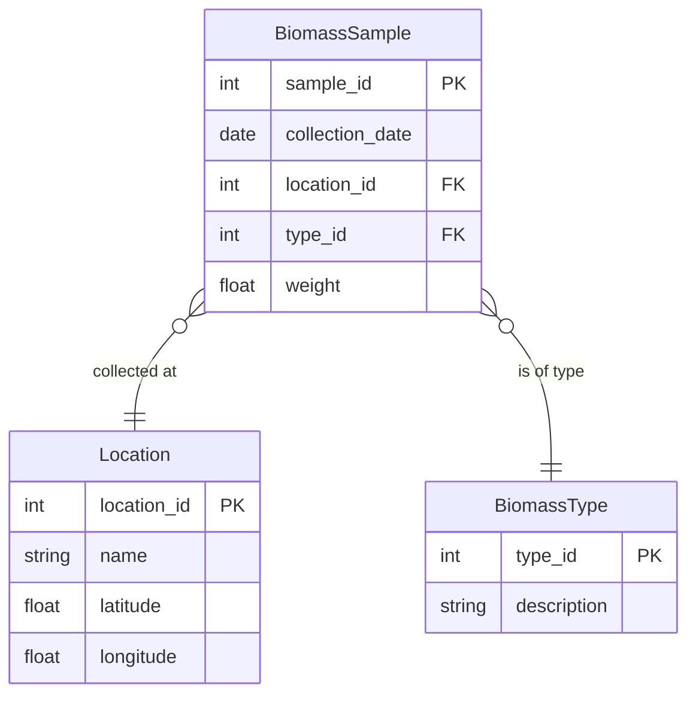

# Design and UX Issues in BRIT Website

## Visual Design Issues

1. **Limited Visual Hierarchy**
   - The website uses the default sb-admin-2 template with minimal customization
   - Content sections lack clear visual hierarchy to guide users through information
   - Limited use of whitespace to separate content sections
   - Text-heavy sections without sufficient visual breaks

2. **Outdated Design Elements**
   - The admin template design feels dated compared to modern web standards
   - Card-based layout is functional but lacks visual interest
   - Limited use of modern design patterns like subtle shadows, gradients, or animations
   - Minimal visual feedback for interactive elements

3. **Color Scheme Limitations**
   - Primarily uses default Bootstrap colors with limited customization
   - Lack of a cohesive color palette that reflects the bioresource/environmental theme
   - Insufficient color contrast in some areas
   - Missed opportunity to use color to create visual interest and guide attention

4. **Typography Issues**
   - Default font choices without customization for brand identity
   - Limited variation in typography to establish hierarchy
   - Text size and spacing could be improved for better readability
   - Inconsistent text alignment in some sections

## Navigation and Usability Issues

1. **Mobile Navigation Problems**
   - While the site has a viewport meta tag and some responsive code, mobile implementation is incomplete
   - Sidebar navigation doesn't properly collapse on mobile devices
   - No hamburger menu appears despite code existing for it
   - Content doesn't properly reflow on smaller screens

2. **Navigation Structure**
   - Sidebar navigation is functional but lacks visual cues for current section
   - No breadcrumbs to help users understand their location within the site
   - Limited secondary navigation within sections
   - No quick links to frequently accessed content

3. **Missing Interactive Elements**
   - Limited use of hover states and transitions for interactive elements
   - Buttons and links lack consistent styling
   - Form elements have minimal styling and feedback
   - Tables lack sorting and filtering options in some sections

4. **Content Organization**
   - Information architecture could be improved for more intuitive content discovery
   - Related content isn't always linked or suggested
   - Limited use of progressive disclosure for complex information
   - Search functionality is limited or not prominently featured

## Technical Implementation Issues

1. **Responsive Design Limitations**
   - Media queries in brit.css are limited primarily to table layouts
   - Bootstrap's responsive features aren't fully utilized
   - Sidebar toggle functionality doesn't work properly on mobile
   - Images and content containers don't always scale appropriately

2. **Inconsistent Component Usage**
   - Inconsistent use of Bootstrap components across different sections
   - Custom styling sometimes conflicts with Bootstrap defaults
   - Limited use of reusable component patterns
   - Some UI elements appear to be custom-built rather than using available Bootstrap components

3. **JavaScript Functionality**
   - Limited custom JavaScript beyond the template defaults
   - Minimal interactive features that could enhance user experience
   - No modern JS frameworks utilized for more dynamic interfaces
   - Limited AJAX implementation for smoother data loading

4. **Accessibility Concerns**
   - Potential accessibility issues with color contrast
   - Form elements may lack proper ARIA attributes
   - Interactive elements may not be fully keyboard accessible
   - Alternative text for images may be inconsistent

## Content and Information Issues

1. **Limited Visual Data Representation**
   - Maps and data visualizations could be more interactive and informative
   - Limited use of charts, graphs, and infographics to present information
   - Data-heavy sections rely too much on tables rather than visual representations
   - Missed opportunities for interactive data exploration

2. **Content Presentation**
   - Text-heavy sections without sufficient visual breaks
   - Limited use of icons, illustrations, or imagery to support content
   - Inconsistent content formatting across different sections
   - Some sections lack clear calls-to-action

3. **Feedback and Guidance**
   - Limited user feedback for actions and interactions
   - Insufficient guidance for new users
   - No tooltips or contextual help for complex features
   - Error messages and validation feedback could be improved

4. **Missing Features**
   - No dark mode option
   - Limited personalization options for users
   - No quick filters or sorting options in list views
   - Limited sharing or export functionality for data and resources
