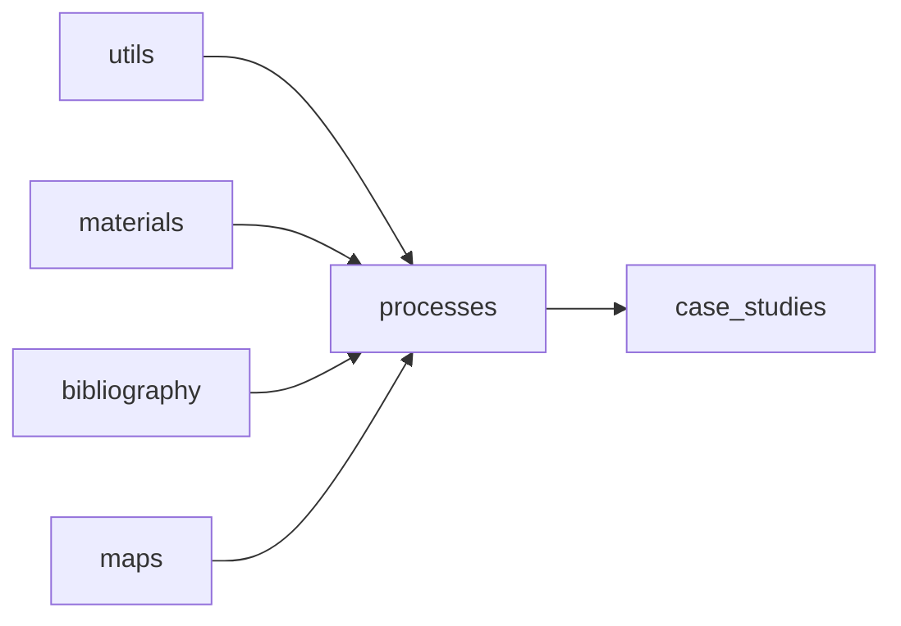

# Processes App: Hierarchy & Dependencies

This document outlines the dependency relationships between BRIT apps, centering on the new **Processes** app.

---

## Core Utilities (no external deps)
- **utils**: provides mixins, viewsets, filters, forms, widgets, and **file export** functionality (`utils.file_export`).

## Independent Modules (standalone)
- **materials**: defines `Material`, `MaterialCategory`.
- **bibliography**: manages `Source` models (aka **Sources**).
- **maps**: handles geospatial data and visualization.

## Processes App
**Dependencies**:
- **utils**
- **materials**
- **bibliography**
- **maps**

This ensures Processes can leverage core utilities, material definitions, documentation sources, and mapping services, while not imposing on them.

---

## Dependent Modules
- **case_studies** (`case_studies.*`): may consume **Processes** APIs for scenario-specific workflows. Processes has no direct dependency on any case study.

---

## Dependency Diagram

---

*End of document*
